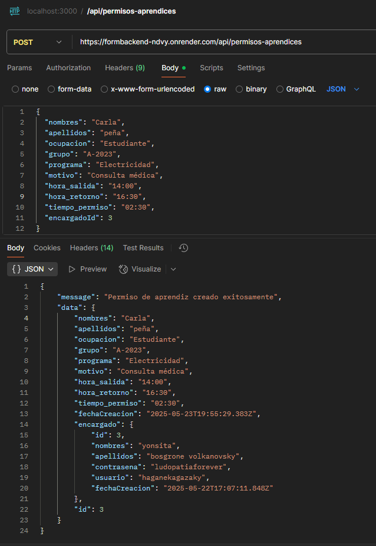
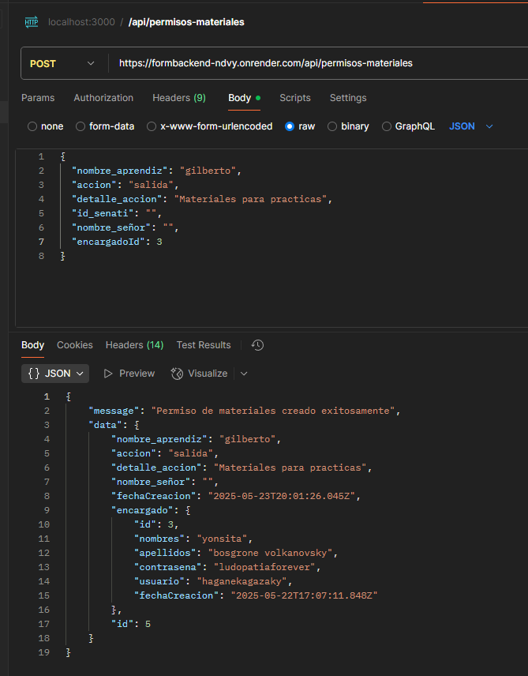
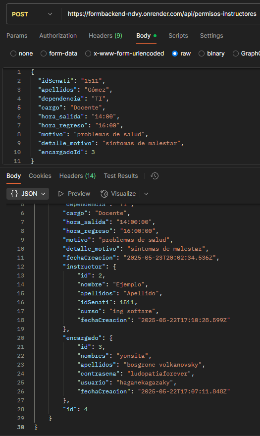

# BACKEND EQUIPO VERDE

--#Guia uso de APIS => registros (POST) formularios permisos:
BASE URL DE LA API: https://formbackend-ndvy.onrender.com

endpoint : /api/permisos-aprendices

estructura ejemplo JSON que espera el endpoint:

{
  "nombres": "Carla",
  "apellidos": "peña",
  "ocupacion": "Estudiante",
  "grupo": "A-2023",
  "programa": "Electricidad",
  "motivo": "Consulta médica",
  "hora_salida": "14:00",
  "hora_retorno": "16:30",
  "tiempo_permiso": "02:30",
  "encargadoId": 3
}

endpoint : /api/permisos-materiales

estructura ejemplo JSON que espera el endpoint:

{
  "nombre_aprendiz": "gilberto",
  "accion": "salida",
  "detalle_accion": "Materiales para practicas",
  "id_senati": "",  
  "nombre_señor": "",
  "encargadoId": 3        
}

  

endpoint : /api/permisos-instructores

estructura ejemplo JSON que espera el endpoint:

{
  "idSenati": "1511",
  "apellidos": "Gómez",
  "dependencia": "TI",
  "cargo": "Docente",
  "hora_salida": "14:00",
  "hora_regreso": "16:00",
  "motivo": "problemas de salud",
  "detalle_motivo": "sintomas de malestar",
  "encargadoId": 3
}

